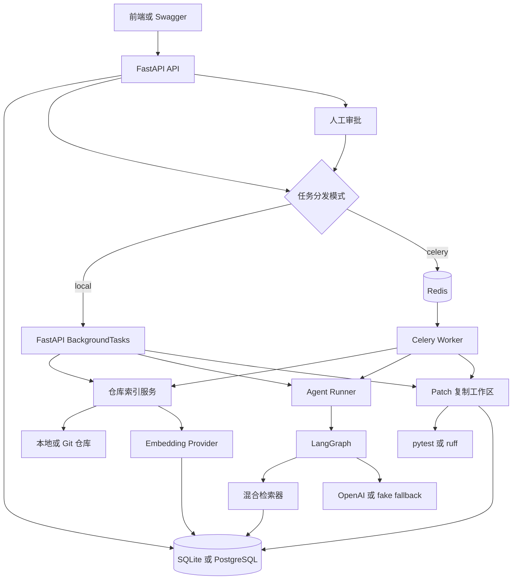

# CodeTeam Agent 项目完整说明

> 本文面向第一次接触 FastAPI、RAG、LangChain、LangGraph、Celery 和 pgvector 的读者。你不需要预先理解这些技术。本文会先讲“它们是什么”，再讲“本项目为什么需要它们”，最后对应到具体代码。

## 1. 这个项目到底是做什么的

CodeTeam Agent 是一个“阅读代码仓库并协助完成研发任务”的后端系统。

用户可以先导入一个本地代码仓库或 Git 仓库，然后提出问题，例如：

- 登录功能在哪些文件中实现？
- Token 校验失败可能是什么原因？
- 应该怎样修改这个接口？
- 应该增加哪些测试？
- 能否生成一个代码补丁并验证它？

系统不会直接把整个仓库发送给大模型。它会先把代码拆成较小的代码块，生成向量并存入数据库。用户提问后，系统检索最相关的代码块，再让多个职责不同的 Agent 按顺序处理任务。

完整流程如下：

```text
导入仓库
  -> 扫描文件
  -> 切分代码
  -> 生成 Embedding
  -> 保存索引
  -> 用户创建任务
  -> Planner 制定计划
  -> Retriever 检索代码证据
  -> Analyst 分析代码
  -> Developer 生成修改方案或 Patch
  -> Reviewer 审查方案
  -> Reporter 汇总报告
  -> 人工批准 Patch
  -> 在复制工作区应用 Patch
  -> 执行测试
  -> 保存测试结果
```

这是一条完整的 MVP 流程，但它不是面向陌生用户的生产级 SaaS。特别是 Patch 测试仍会执行仓库中的代码，当前“复制工作区”不能替代 Docker、microVM 等操作系统级沙箱。

## 2. 先理解几个基础概念

### 2.1 API 是什么

API 可以理解为后端暴露给前端或其他程序的一组入口。

例如：

```http
POST /api/v1/tasks
```

意思是向 `/api/v1/tasks` 发送一个 HTTP POST 请求，用于创建任务。

请求体可能是：

```json
{
  "repository_id": "仓库ID",
  "user_request": "解释登录流程"
}
```

FastAPI 负责接收请求、检查参数、调用 Python 函数并把结果转换成 JSON。

### 2.2 Agent 是什么

在这个项目里，Agent 不是一个独立进程，也不是一个真正的人。它是“具有特定角色提示词、输入格式和输出格式的大模型处理步骤”。

例如：

- Planner 只负责拆解任务。
- Analyst 只负责根据证据解释代码。
- Developer 只负责提出改动。
- Reviewer 只负责找风险和测试点。

把职责拆开，可以减少一个 Prompt 同时承担太多任务造成的混乱。

### 2.3 Multi-Agent 是什么

Multi-Agent 是多个 Agent 按工作流协作。

本项目不是让几个模型自由聊天，而是用 LangGraph 明确规定执行顺序：


这种方式更容易测试、记录和限制成本。

### 2.4 RAG 是什么

RAG 是 Retrieval-Augmented Generation，中文常译为“检索增强生成”。

它解决的问题是：大模型不知道你的私有仓库内容，而且一次也放不下整个仓库。

RAG 分成两个阶段：

1. 索引阶段：代码切块、生成向量、保存到数据库。
2. 查询阶段：把用户问题也生成向量，找到最相关代码，再把代码证据交给 Agent。

因此，RAG 的重点不是“让模型记住仓库”，而是“每次回答前给模型找到相关证据”。

### 2.5 Embedding 是什么

Embedding 是把文本转换成一串数字。例如：

```text
"validate token" -> [0.12, -0.08, 0.31, ...]
```

语义相近的文本，其向量方向通常也更接近。系统可以通过余弦距离判断两个向量的相似程度。

本项目支持两种 Embedding：

- `hash`：本地确定性算法，不需要 API Key，适合测试。
- `openai`：调用 OpenAI Embedding，语义能力更强。

### 2.6 pgvector 是什么

PostgreSQL 原本擅长保存字符串、数字和 JSON。pgvector 扩展让 PostgreSQL 可以保存向量，并执行向量距离排序。

本项目在 PostgreSQL 中使用：

```text
VECTOR(1536)
```

表示每个向量包含 1536 个浮点数。

`<=>` 是 pgvector 的余弦距离操作符。距离越小，向量越相似。

### 2.7 Celery 和 Redis 是什么

索引大型仓库或调用多个 Agent 可能需要几十秒。API 不应该一直占着请求等待。

因此系统可以把任务发送给 Celery Worker：

```text
FastAPI -> Redis 队列 -> Celery Worker -> 执行任务 -> 数据库
```

Redis 在这里像一个任务中转站。Celery Worker 从 Redis 取任务并执行。

本地没有 Redis 时，项目也支持 `local` 模式，使用 FastAPI 的进程内后台任务。

## 3. 项目整体架构



各层职责：

| 层 | 主要文件 | 作用 |
|---|---|---|
| 配置层 | `config.py` | 读取 `.env` 和默认配置 |
| API 层 | `api/repos.py`、`api/tasks.py` | 接收 HTTP 请求 |
| 数据层 | `database.py`、`models.py` | 数据库连接和表结构 |
| 索引层 | `indexing/*` | 扫描、切分、向量化代码 |
| RAG 层 | `rag/retriever.py` | 混合检索代码证据 |
| Agent 层 | `agents/*` | 定义角色、状态和 LangGraph |
| 队列层 | `worker.py`、`tasks.py` | Celery 异步任务 |
| Patch 层 | `sandbox.py` | 审批后应用 Patch 并测试 |
| 测试层 | `tests/*` | 验证关键行为 |

## 4. 目录结构

```text
agent project/
├─ src/codeteam/
│  ├─ main.py                  # FastAPI 应用入口
│  ├─ config.py                # 环境配置
│  ├─ database.py              # SQLAlchemy Engine 和 Session
│  ├─ models.py                # 数据库表
│  ├─ schemas.py               # API 请求和响应结构
│  ├─ worker.py                # Celery 应用
│  ├─ tasks.py                 # Celery 任务定义
│  ├─ sandbox.py               # Patch 检查、应用和测试
│  ├─ api/
│  │  ├─ repos.py              # 仓库 API
│  │  ├─ tasks.py              # Agent 任务与审批 API
│  │  └─ background.py         # local/celery 分发器
│  ├─ indexing/
│  │  ├─ repo_loader.py        # 获取和扫描仓库
│  │  ├─ code_splitter.py      # 代码切块
│  │  ├─ embeddings.py         # Embedding 实现
│  │  └─ service.py            # 索引总流程
│  ├─ rag/
│  │  └─ retriever.py          # 混合检索
│  └─ agents/
│     ├─ state.py              # 图的共享状态
│     ├─ outputs.py            # Agent 结构化输出
│     ├─ prompts.py            # Agent 系统提示词
│     ├─ graph.py              # LangGraph 工作流
│     ├─ runner.py             # 执行图并保存步骤
│     └─ tools.py              # LangChain Tool 定义
├─ tests/                      # 自动化测试
├─ pyproject.toml              # Python 依赖和工具配置
├─ Dockerfile                  # API/Worker 镜像
├─ docker-compose.yml          # API、Worker、Redis、PostgreSQL
└─ .env.example                # 环境变量示例
```

## 5. 应用如何启动

### 5.1 FastAPI 入口

核心代码位于 `main.py`：

```python
settings = get_settings()
app = FastAPI(title=settings.app_name, version="0.1.0", lifespan=lifespan)
app.include_router(repositories_router, prefix="/api/v1")
app.include_router(tasks_router, prefix="/api/v1")
```

逐行解释：

1. `get_settings()` 读取环境变量和默认配置。
2. `FastAPI(...)` 创建 Web 应用对象。
3. `lifespan=lifespan` 表示应用启动和关闭时执行 `lifespan` 函数。
4. `include_router` 把仓库路由和任务路由注册到应用。
5. `prefix="/api/v1"` 给路由统一加版本前缀。

因此 `repos.py` 中的 `/repositories` 最终会变成：

```text
/api/v1/repositories
```

### 5.2 lifespan 启动逻辑

```python
@asynccontextmanager
async def lifespan(_: FastAPI):
    if engine.dialect.name == "postgresql":
        with engine.begin() as connection:
            connection.execute(text("CREATE EXTENSION IF NOT EXISTS vector"))
    Base.metadata.create_all(bind=engine)
    yield
```

关键语法：

- `@asynccontextmanager` 是装饰器，把异步生成器转换成上下文管理器。
- `yield` 之前的代码在应用启动时运行。
- `yield` 之后的代码会在应用关闭时运行；当前没有关闭逻辑。
- `engine.dialect.name` 表示正在使用哪种数据库。
- 只有 PostgreSQL 才需要创建 `vector` 扩展。
- `Base.metadata.create_all` 根据 ORM 模型创建尚不存在的数据表。

启动时还会创建：

```python
get_settings().repository_root.mkdir(parents=True, exist_ok=True)
get_settings().sandbox_root.mkdir(parents=True, exist_ok=True)
```

`parents=True` 表示父目录不存在时一起创建，`exist_ok=True` 表示目录已存在时不报错。

### 5.3 健康检查

```python
@app.get("/health")
def health() -> dict[str, str]:
    return {"status": "ok", "environment": settings.environment}
```

`@app.get` 把函数注册为 GET API。返回字典后，FastAPI 会自动转换成 JSON。

## 6. 配置系统

配置定义在 `config.py`：

```python
class Settings(BaseSettings):
    database_url: str = "sqlite:///./codeteam.db"
    llm_provider: str = "fake"
    embedding_provider: str = "hash"
    task_dispatch_mode: str = "local"
```

`BaseSettings` 来自 Pydantic Settings。它会优先读取环境变量，没有环境变量时使用等号右侧默认值。

例如环境中存在：

```dotenv
TASK_DISPATCH_MODE=celery
```

那么 `settings.task_dispatch_mode` 就是 `celery`，而不是默认的 `local`。

完整配置：

| 配置 | 作用 | 默认值 |
|---|---|---|
| `APP_NAME` | API 名称 | `CodeTeam Agent API` |
| `ENVIRONMENT` | 环境名称 | `development` |
| `DATABASE_URL` | 数据库连接地址 | SQLite 本地文件 |
| `REPOSITORY_ROOT` | 克隆仓库保存目录 | `./data/repositories` |
| `LLM_PROVIDER` | Agent 模型提供方 | `fake` |
| `LLM_MODEL` | OpenAI 模型名 | `gpt-4o-mini` |
| `OPENAI_API_KEY` | OpenAI 密钥 | 空 |
| `EMBEDDING_PROVIDER` | Embedding 提供方 | `hash` |
| `EMBEDDING_MODEL` | Embedding 模型 | `text-embedding-3-small` |
| `EMBEDDING_DIMENSIONS` | 向量维度 | 固定 1536 |
| `CELERY_BROKER_URL` | Celery 队列地址 | Redis DB 0 |
| `CELERY_RESULT_BACKEND` | Celery 结果地址 | Redis DB 1 |
| `TASK_DISPATCH_MODE` | `local` 或 `celery` | `local` |
| `AGENT_MAX_RETRIEVAL_ATTEMPTS` | 最多检索次数 | 2 |
| `AGENT_MAX_REVISION_ATTEMPTS` | 最多返工次数 | 2 |
| `SANDBOX_ROOT` | Patch 复制工作区 | `./data/sandboxes` |
| `SANDBOX_TIMEOUT_SECONDS` | 测试超时秒数 | 120 |
| `SANDBOX_ALLOWED_COMMANDS` | 允许执行的命令 | `pytest,ruff` |

配置缓存：

```python
@lru_cache
def get_settings() -> Settings:
    return Settings()
```

`@lru_cache` 让第一次创建的 `Settings` 被缓存，后续调用返回同一个对象，避免每次请求都重新读取 `.env`。

## 7. 数据库连接是怎么工作的

### 7.1 Engine

`database.py` 中：

```python
def _create_engine():
    database_url = get_settings().database_url
    connect_args = {"check_same_thread": False} if database_url.startswith("sqlite") else {}
    return create_engine(database_url, connect_args=connect_args)
```

Engine 可以理解为“数据库连接工厂”。

SQLite 默认限制连接只能在创建它的线程中使用。FastAPI 可能在线程池中处理同步函数，因此开发模式加入 `check_same_thread=False`。

### 7.2 Session

```python
SessionLocal = sessionmaker(bind=engine, autoflush=False, expire_on_commit=False)
```

Session 是一次数据库工作单元。通过它可以查询、添加、修改和提交对象。

- `autoflush=False`：不在每次查询前自动把所有改动 flush 到数据库。
- `expire_on_commit=False`：提交后 ORM 对象的字段仍可直接读取。

### 7.3 FastAPI 依赖注入

```python
def get_db() -> Generator[Session, None, None]:
    with SessionLocal() as session:
        yield session

DbSession = Annotated[Session, Depends(get_db)]
```

当 API 参数写成：

```python
def get_task(task_id: str, session: DbSession):
```

FastAPI 会调用 `get_db()` 创建 Session，传给 `session` 参数，并在请求结束后自动关闭 Session。

## 8. 数据库表分别保存什么

### 8.1 Repository

`Repository` 保存一个代码仓库：

```python
class Repository(Base):
    id
    name
    source_url
    local_path
    branch
    commit_hash
    status
    error_message
```

状态变化：

```text
pending -> indexing -> ready
                    -> failed
```

### 8.2 CodeChunk

`CodeChunk` 保存一个代码块：

```python
class CodeChunk(Base):
    repository_id
    file_path
    language
    symbol_name
    chunk_type
    start_line
    end_line
    content
    embedding
```

这一行实现双数据库兼容：

```python
embedding = mapped_column(
    JSON().with_variant(VECTOR(1536), "postgresql"), nullable=True
)
```

含义：

- SQLite 不支持 pgvector，因此用 JSON 数组保存向量。
- PostgreSQL 使用真正的 `VECTOR(1536)`。
- Python 属性仍统一表现为 `list[float]`。

### 8.3 AgentTask

`AgentTask` 保存用户提出的一次研发任务，包括请求、状态、最终报告和错误。

状态变化：

```text
pending -> running -> completed
                   -> failed
```

### 8.4 AgentStep

每执行一个 LangGraph 节点，就保存一条 `AgentStep`。

例如：

```text
1 planner
2 retriever
3 analyst
4 developer
5 reviewer
6 reporter
```

如果发生重新检索或返工，步骤中可能重复出现 `retriever`、`analyst`、`developer` 或 `reviewer`。

### 8.5 PatchExecution

当 Developer 返回 `unified_diff` 时，系统创建 `PatchExecution`。

它保存：

- Patch 文本
- 测试命令
- 审批状态
- 复制工作区路径
- Patch 应用输出
- 测试输出
- 退出码
- 错误信息

状态变化：

```text
awaiting_approval -> rejected
awaiting_approval -> approved -> running -> succeeded
                                      -> failed
```

## 9. 仓库导入 API

创建仓库：

```python
@router.post("", response_model=RepositoryRead)
def create_repository(payload: RepositoryCreate, session: DbSession):
```

`payload` 是经过 Pydantic 校验的请求体，`session` 由 FastAPI 自动注入。

核心逻辑：

```python
repository = Repository(...)
session.add(repository)
session.flush()
```

`add()` 把对象加入当前事务。`flush()` 把 INSERT 发给数据库，但还没有正式提交。调用 `flush()` 后就能得到数据库生成的 `repository.id`。

远程仓库没有手动指定本地路径时，系统用 ID 生成目录：

```python
repository.local_path = str(
    (get_settings().repository_root / repository.id).resolve()
)
```

最后：

```python
session.commit()
session.refresh(repository)
```

- `commit()` 正式提交事务。
- `refresh()` 从数据库重新读取对象，确保返回最新字段。

## 10. 仓库索引如何实现

### 10.1 准备仓库

`prepare_repository()` 分两种情况：

```python
if source_url:
    if target.exists() and (target / ".git").exists():
        repo.remotes.origin.pull()
    else:
        Repo.clone_from(source_url, target, branch=branch)
```

- 目标目录已经是 Git 仓库：执行 pull。
- 目标目录不存在：执行 clone。
- 没有 `source_url`：把 `local_path` 当成本地目录。

### 10.2 扫描文件

`iter_source_files()` 使用：

```python
for path in root.rglob("*"):
```

`rglob("*")` 会递归遍历所有子目录。

然后过滤：

- `.git`、`.venv`、`node_modules` 等无关目录。
- 不在支持扩展名列表中的文件。
- 超过 1 MB 的文件。
- 不能按 UTF-8 解码的文件。

`yield SourceFile(...)` 表示它是一个生成器，不会先把所有文件一次性放入内存。

### 10.3 Python AST 切分

Python 文件会先执行：

```python
tree = ast.parse(source.content)
```

AST 是抽象语法树。它把源代码解析成“类、函数、语句”等结构，而不是单纯字符串。

系统只遍历顶层节点：

```python
for node in tree.body:
    if not isinstance(node, (ast.ClassDef, ast.FunctionDef, ast.AsyncFunctionDef)):
        continue
```

因此当前会提取顶层类和函数。类中的方法会作为整个类代码块的一部分，不会单独成为 CodeChunk。

通过：

```python
start_line = node.lineno
end_line = node.end_lineno
```

保存准确行号，然后切出对应源码。

其他语言目前按每 120 行切分。这能工作，但不如 Tree-sitter 的符号级切分精确。

### 10.4 索引服务

`index_repository()` 是索引总控制函数：

```python
repository.status = RepositoryStatus.indexing
session.commit()
```

先把状态改成 `indexing`，这样 API 查询时能知道任务正在执行。

重新索引前删除旧块：

```python
session.execute(
    delete(CodeChunk).where(CodeChunk.repository_id == repository.id)
)
```

然后：

```python
chunk_data = [
    chunk
    for source_file in iter_source_files(root)
    for chunk in split_source_file(source_file)
]
```

这是双层列表推导式，等价于：

```python
chunk_data = []
for source_file in iter_source_files(root):
    for chunk in split_source_file(source_file):
        chunk_data.append(chunk)
```

再批量生成向量：

```python
embeddings = create_embeddings().embed_documents(
    [chunk.content for chunk in chunk_data]
)
```

最后将代码块和向量一一保存。

`zip(..., strict=True)` 要求代码块数量与向量数量完全一致。如果 Embedding 返回数量不对，会立即报错，不会悄悄丢数据。

## 11. Embedding 如何实现

### 11.1 Hash Embedding

Hash Embedding 不是真正的语义模型，主要用于离线测试。

流程：

1. 用正则表达式提取英文标识符或中文字符。
2. 对每个 token 计算 SHA-256。
3. 根据 hash 结果选择向量位置。
4. 对出现的位置加 1。
5. 对向量做归一化。

归一化代码：

```python
magnitude = math.sqrt(sum(value * value for value in vector))
return [value / magnitude for value in vector]
```

向量长度为：

$$
\|x\| = \sqrt{\sum_{i=1}^{n} x_i^2}
$$

每个元素除以长度后，向量长度变成 1，便于计算余弦相似度。

### 11.2 OpenAI Embedding

```python
return OpenAIEmbeddings(
    model=settings.embedding_model,
    api_key=settings.openai_api_key,
    dimensions=settings.embedding_dimensions,
)
```

这会调用 OpenAI API。索引时调用 `embed_documents`，查询时调用 `embed_query`。

如果选择 `openai` 却没有配置 Key，代码主动抛错，而不是退回 hash，避免开发者误以为自己正在使用真实 Embedding。

## 12. 混合检索如何实现

混合检索同时考虑：

- 向量语义分数
- 关键词重合分数
- 精确包含奖励

总分公式：

$$
score = 0.55 \times vectorScore + 0.45 \times keywordScore + exactBonus
$$

### 12.1 PostgreSQL 路径

```python
distance = CodeChunk.embedding.op("<=>")(query_embedding)
```

生成类似 SQL：

```sql
ORDER BY embedding <=> :query_embedding
```

先由 PostgreSQL 和 HNSW 索引取候选集：

```python
candidate_limit = max(limit * 8, 40)
```

如果最终要 8 条，先取最多 64 条候选，再用关键词分数重排。

余弦距离转换成相似度：

```python
vector_score = max(0.0, 1.0 - distance)
```

### 12.2 SQLite 路径

SQLite 没有 pgvector，因此读取该仓库所有代码块，在 Python 中执行 `_cosine()`。

余弦相似度公式：

$$
\cos(\theta) = \frac{A \cdot B}{\|A\|\|B\|}
$$

这适合小仓库和测试，不适合大型生产数据。

### 12.3 关键词分数

```python
keyword_score = len(query_tokens & searchable_tokens) / max(len(query_tokens), 1)
```

`&` 是集合交集。例如：

```text
query_tokens      = {validate, token}
searchable_tokens = {user, validate, token, auth}
交集               = {validate, token}
```

关键词分数就是 $2 / 2 = 1$。

## 13. LangChain Tool 是什么

`agents/tools.py` 使用 `@tool` 定义了：

- `search_code`：混合检索代码。
- `read_file_chunk`：根据 chunk ID 读取代码块。
- `list_repo_tree`：列出已索引文件路径。

例如：

```python
@tool
def search_code(query: str, limit: int = 8) -> list[dict]:
    ...
```

`@tool` 会把普通 Python 函数转换成 LangChain Tool，包括函数名、参数结构和 docstring 描述。

需要特别说明：当前 `graph.py` 的 Retriever 节点直接调用 `HybridCodeRetriever`，并没有把这些 Tool 绑定给模型让模型自主选择。也就是说，Tool 已经定义好，但目前属于后续扩展接口，不是主流程实际的自主 Tool Calling。

## 14. Agent 的输入输出为什么要结构化

输出模型在 `agents/outputs.py` 中定义：

```python
class PlanOutput(BaseModel):
    task_type: str
    summary: str
    search_queries: list[str]
    investigation_steps: list[str]
```

如果让模型自由输出文本，下一节点很难稳定解析。使用 Pydantic 后，Planner 必须返回固定字段。

Developer 输出：

```python
class ImplementationOutput(BaseModel):
    approach: str
    file_changes: list[str]
    constraints: list[str]
    unified_diff: str | None = None
    test_command: list[str]
```

`str | None` 表示字段可以是字符串，也可以为空。不是每个分析任务都需要 Patch。

## 15. LangGraph 状态是什么

`AgentState` 是所有节点共享的数据字典：

```python
class AgentState(TypedDict, total=False):
    repository_id: str
    user_request: str
    plan: dict
    retrieved_context: list[dict]
    analysis: dict
    implementation: dict
    review: dict
```

每个节点读取已有字段，并返回它新增或更新的字段。

例如 Planner 返回：

```python
return {"plan": output.model_dump()}
```

LangGraph 把它合并进 State。下一个 Retriever 就能读取 `state["plan"]`。

`total=False` 表示状态字典在执行早期不需要拥有全部字段。例如 Planner 执行前还没有 `review`。

## 16. 每个 Agent 节点做什么

### 16.1 Planner

输入：用户原始请求。

输出：任务类型、摘要、检索问题和调查步骤。

无模型时 fallback 会生成三个检索问题：

```python
[
    request,
    f"implementation related to {request}",
    f"tests for {request}",
]
```

### 16.2 Retriever

Retriever 遍历 Planner 给出的多个 query，每个 query 取 5 条结果。

相同代码块可能被多个 query 命中，因此使用字典按 `chunk_id` 去重，并保留更高分数。

最终取前 12 条证据：

```python
ranked[:12]
```

如果上一轮 Analyst 产生了 `uncertainties`，重试时把这些不确定项也作为查询。

### 16.3 Analyst

Analyst 只能根据 `retrieved_context` 分析，并生成：

- `findings`：发现。
- `call_flow`：可能的调用路径。
- `evidence_refs`：文件和行号引用。
- `uncertainties`：证据不足之处。

证据引用格式类似：

```text
src/auth.py:10-28
```

### 16.4 Developer

Developer 接收用户请求、计划、分析和上一轮 Review 反馈。

它输出实现方案，也可以输出 unified diff 和测试命令。

`fake` 模式不会生成真实 Patch，`unified_diff` 为 `None`。只有真实模型按结构化输出成功返回 Patch 时，系统才创建审批记录。

### 16.5 Reviewer

Reviewer 检查：

- 风险
- 边界条件
- 测试建议
- verdict

如果 verdict 是 `needs_revision`，图可能回到 Developer。

### 16.6 Reporter

Reporter 不再调用模型，只把前面结果组成最终报告：

```python
{
    "request": ...,
    "plan": ...,
    "evidence": ...,
    "analysis": ...,
    "implementation": ...,
    "review": ...,
}
```

## 17. Agent 循环为什么不会无限执行

分析后的条件边：

```python
if not retrieved_context and retrieval_attempts < max_attempts:
    return "retry"
return "continue"
```

Reviewer 后的条件边：

```python
if verdict == "needs_revision" and revision_attempts < max_attempts:
    return "revise"
return "finish"
```

即使模型一直说“需要返工”，达到上限后也会进入 Reporter。这样可以限制：

- API 成本
- 执行时间
- 无限循环风险

## 18. fake 模式和 OpenAI 模式的区别

核心函数：

```python
if settings.llm_provider != "openai" or not settings.openai_api_key:
    return fallback
```

### fake 模式

- 不调用大模型。
- 输出由代码预先构造。
- 可验证图、数据库、RAG 和 API。
- 不具备真正的代码推理和 Patch 生成能力。

### OpenAI 模式

```python
model = ChatOpenAI(...).with_structured_output(schema)
```

`with_structured_output(schema)` 要求模型按 Pydantic Schema 返回内容。

`temperature=0` 用于降低随机性，让工程任务输出相对稳定。

## 19. Runner 如何保存 Agent 执行过程

`run_agent_task()` 先更新状态：

```python
task.status = TaskStatus.running
session.commit()
```

然后流式执行图：

```python
for update in graph.stream(state, stream_mode="updates"):
```

`stream_mode="updates"` 表示每完成一个节点就返回该节点产生的更新，而不是等整个图完成。

每次更新都创建 `AgentStep`，因此可以在数据库看到每一步输出。

最后：

```python
task.final_report = state["final_report"]
```

如果 Developer 生成 Patch：

```python
if unified_diff:
    task.patch_execution = PatchExecution(...)
```

此时 Patch 状态默认为 `awaiting_approval`，不会自动执行。

异常处理使用：

```python
except Exception as exc:
    session.rollback()
    task.status = TaskStatus.failed
```

`rollback()` 撤销当前未提交事务，再单独保存失败状态。

## 20. 异步任务如何分发

`api/background.py` 提供统一 `_dispatch()`：

```python
if mode == "celery":
    celery_job(resource_id)
elif mode == "local":
    background_tasks.add_task(local_job, resource_id)
```

这样 API 不需要关心任务具体由谁执行。

### local 模式

优点：

- 不需要 Redis。
- 启动简单。

缺点：

- API 进程重启后任务会丢失。
- 耗时任务与 API 共用资源。
- 不适合生产环境。

### celery 模式

`worker.py` 创建 Celery 应用：

```python
celery_app = Celery(
    "codeteam",
    broker=settings.celery_broker_url,
    backend=settings.celery_result_backend,
)
```

- broker 是任务队列。
- backend 保存 Celery 任务结果。
- 本项目最终业务状态仍以数据库为准。

任务装饰器：

```python
@celery_app.task(
    autoretry_for=(ConnectionError, TimeoutError),
    retry_backoff=True,
    retry_jitter=True,
    retry_kwargs={"max_retries": 3},
)
```

解释：

- 连接错误或超时会自动重试。
- `retry_backoff` 让等待时间逐渐增加。
- `retry_jitter` 加入随机抖动，避免多个失败任务同时重试。
- 最多重试 3 次。

## 21. API 完整说明

### 21.1 创建仓库

```http
POST /api/v1/repositories
Content-Type: application/json
```

本地仓库：

```json
{
  "name": "demo",
  "local_path": "C:\\projects\\demo"
}
```

远程仓库：

```json
{
  "name": "demo",
  "source_url": "https://github.com/example/demo.git",
  "branch": "main"
}
```

### 21.2 启动索引

```http
POST /api/v1/repositories/{repository_id}/index
```

API 返回后，索引可能仍在后台运行。通过 GET 查询状态。

### 21.3 查询仓库

```http
GET /api/v1/repositories/{repository_id}
```

只有 `status=ready` 后才能创建 Agent 任务。

### 21.4 创建 Agent 任务

```http
POST /api/v1/tasks
Content-Type: application/json
```

```json
{
  "repository_id": "仓库ID",
  "user_request": "解释认证流程并建议测试"
}
```

### 21.5 查询任务

```http
GET /api/v1/tasks/{task_id}
```

响应包含：

- `status`
- `steps`
- `final_report`
- `patch_execution`
- `error_message`

### 21.6 审批 Patch

批准：

```http
POST /api/v1/tasks/{task_id}/approval
Content-Type: application/json

{"approved": true}
```

拒绝：

```json
{"approved": false}
```

同一个 Patch 只能决策一次。再次提交会返回 HTTP 409。

## 22. Patch 安全执行如何实现

### 22.1 必须先审批

```python
if execution.status != ApprovalStatus.approved:
    raise ValueError("Patch must be approved before execution")
```

即使有人绕过 API 直接调用执行函数，只要状态不是 `approved` 也不能运行。

### 22.2 复制源仓库

```python
shutil.copytree(
    source,
    sandbox,
    ignore=shutil.ignore_patterns(".git", ".venv"),
)
```

Patch 在副本中应用，源仓库不会被修改。忽略 `.git` 和 `.venv` 可减少复制体积，并避免带入仓库历史和本地虚拟环境。

### 22.3 检查 Patch 路径

系统解析：

- `+++ b/...`
- `--- a/...`
- rename/copy 路径

然后拒绝：

- 绝对路径
- 包含 `..` 的路径
- 符号链接 Patch

目的是阻止 Patch 写到复制工作区之外。

### 22.4 Git 二次校验

```python
git apply --check patch_file
git apply patch_file
```

第一条只检查 Patch 是否能应用，不修改文件。检查成功后第二条才真正应用。

### 22.5 命令白名单

```python
allowed = {"pytest", "ruff"}
```

系统只检查命令列表的第一个元素，例如：

```python
["pytest", "-q"]
```

第一个元素是 `pytest`，在白名单中，因此允许执行。

命令通过 `subprocess.run(..., shell=False)` 执行。`shell=False` 避免把参数拼成 shell 命令，降低 `; rm ...` 或 `& ...` 一类 shell 注入风险。

### 22.6 超时和输出

```python
subprocess.run(
    ...,
    timeout=settings.sandbox_timeout_seconds,
    capture_output=True,
    text=True,
)
```

- `timeout` 限制运行时间。
- `capture_output` 捕获 stdout 和 stderr。
- `text=True` 让输出成为字符串。
- 退出码为 0 表示测试成功。

### 22.7 这为什么还不是真正的沙箱

即使命令只能是 `pytest`，pytest 会导入并运行仓库 Python 代码。恶意测试仍可以读取文件、访问网络或启动子进程。

因此公开部署前，应在临时 Docker 容器或 microVM 中执行，并配置：

- 非 root 用户
- 只读基础文件系统
- 禁止网络
- CPU 和内存限制
- 进程数量限制
- 执行后销毁容器

## 23. Docker Compose 中的四个服务

```text
api       FastAPI 服务
worker    Celery Worker
redis     任务队列和 Celery 结果后端
database  PostgreSQL + pgvector
```

API 与 Worker 必须共享：

- `repository_data`：克隆的仓库。
- `sandbox_data`：Patch 复制工作区。

否则 API 保存的路径在 Worker 容器中可能不存在。

PostgreSQL 数据保存在 `postgres_data`，Redis AOF 保存在 `redis_data`。

## 24. 测试分别验证什么

| 测试文件 | 验证内容 |
|---|---|
| `test_code_splitter.py` | Python 符号名和行号切分 |
| `test_indexing_and_retrieval.py` | 索引仓库并找回认证代码 |
| `test_agent_workflow.py` | 六个 Agent 节点和最终报告 |
| `test_api.py` | 健康检查、仓库 API、拒绝 Patch |
| `test_advanced_features.py` | Embedding 配置、pgvector DDL、循环上限、Patch 安全执行 |

一个典型测试采用 Arrange、Act、Assert 三段：

```python
# Arrange：准备数据
repository = Repository(...)
session.add(repository)
session.commit()

# Act：执行目标行为
index_repository(session, repository.id)

# Assert：检查结果
assert repository.status == RepositoryStatus.ready
```

测试使用临时 SQLite 数据库和临时仓库，避免污染真实数据。

## 25. 一次真实请求在系统中的完整旅程

假设用户问：

```text
解释 Token 认证，并建议无效 Token 的测试
```

1. 用户调用 `POST /api/v1/tasks`。
2. API 检查仓库是否存在、是否已经 `ready`。
3. API 创建 `AgentTask`，状态为 `pending`。
4. dispatch 层把 task ID 交给本地后台任务或 Celery。
5. Worker 创建新的数据库 Session。
6. Runner 把状态改成 `running`。
7. Planner 生成检索词。
8. Retriever 把检索词转成向量并检索 CodeChunk。
9. Retriever 混合向量分数和关键词分数。
10. Analyst 根据命中的文件、符号和行号生成分析。
11. 如果完全没证据且未超过上限，回到 Retriever。
12. Developer 根据分析提出修改方案。
13. Reviewer 检查风险；必要时回到 Developer。
14. Reporter 生成最终报告。
15. Runner 为每个节点保存 AgentStep。
16. 如果 Developer 返回 diff，创建 `PatchExecution`。
17. 任务状态改成 `completed`。这里的 completed 表示 Agent 分析完成，不表示 Patch 已执行。
18. 用户查看 diff 并调用审批 API。
19. 批准后 dispatch 层启动 Patch 任务。
20. 系统复制仓库、检查路径、执行 `git apply --check`。
21. 系统应用 Patch 并运行白名单测试。
22. PatchExecution 最终变成 `succeeded` 或 `failed`。

## 26. 常见 Python 语法解释

### 26.1 类型注解

```python
def search(query: str, limit: int = 8) -> list[RetrievalResult]:
```

表示：

- `query` 应是字符串。
- `limit` 应是整数，默认值是 8。
- 返回值是 RetrievalResult 列表。

类型注解主要帮助 IDE、阅读者和静态检查工具，Python 运行时通常不会自动强制普通函数参数类型。

### 26.2 dataclass

```python
@dataclass(frozen=True)
class RetrievalResult:
    file_path: str
    score: float
```

`@dataclass` 自动生成初始化方法。`frozen=True` 表示创建后不能修改字段，适合表示检索结果值对象。

### 26.3 ORM Mapped

```python
name: Mapped[str] = mapped_column(String(255))
```

左侧 `Mapped[str]` 表示 Python 中是字符串属性，右侧 `String(255)` 表示数据库列类型和最大长度。

### 26.4 上下文管理器

```python
with SessionLocal() as session:
    ...
```

离开 `with` 块时会自动关闭 Session，即使中间发生异常。

### 26.5 装饰器

```python
@router.post("/tasks")
def create_task(...):
```

装饰器在不改变函数主体的情况下给函数增加行为。这里是把函数注册为 HTTP 路由。

### 26.6 列表切片

```python
ranked[:12]
```

表示从开头取最多 12 个元素，不足 12 个也不会报错。

### 26.7 字典 get

```python
state.get("review")
```

如果 `review` 不存在，返回 `None`，而 `state["review"]` 在字段不存在时会抛出 KeyError。

## 27. 如何本地运行

### 27.1 创建环境和安装依赖

```powershell
py -m venv .venv
.\.venv\Scripts\python.exe -m pip install -e ".[dev]"
```

`-e` 表示 editable install。修改 `src` 代码后不需要重新安装包。

### 27.2 启动 API

```powershell
.\.venv\Scripts\python.exe -m uvicorn codeteam.main:app --reload
```

然后访问：

```text
http://127.0.0.1:8000/docs
```

### 27.3 运行检查

```powershell
.\.venv\Scripts\python.exe -m ruff check src tests
.\.venv\Scripts\python.exe -m pytest -q
```

### 27.4 启动完整 Docker 服务

```powershell
docker compose up --build
```

这会启用 PostgreSQL、pgvector、Redis 和 Celery。

## 28. 当前实现的真实边界

以下功能已经实现：

- 仓库导入和状态管理
- Python AST 切分
- Hash/OpenAI Embedding
- SQLite/PostgreSQL 向量存储
- PostgreSQL HNSW 检索
- 混合检索
- LangGraph 多 Agent 流程
- 检索和 Review 有界循环
- Agent 步骤持久化
- Celery/Redis 分发
- Patch 人工审批
- 复制工作区应用 Patch
- 命令白名单、路径检查和超时

以下功能还不是生产级或尚未实现：

- Java、TypeScript、Go 等语言尚未使用 Tree-sitter 符号切分。
- `agents/tools.py` 的 Tool 尚未接入模型自主 Tool Calling。
- 没有 Alembic 数据库版本迁移。
- 没有用户登录、租户和仓库权限隔离。
- 没有 Git URL 白名单和完整 SSRF 防护。
- 没有 GitHub App、Webhook、自动分支和 PR。
- 没有 LangSmith/OpenTelemetry 观测和成本面板。
- Patch 复制工作区不是 OS 沙箱。
- 没有真实 API Key 时无法验证模型输出质量。

## 29. 推荐阅读代码的顺序

第一次阅读不要从 `models.py` 的每一列开始死记。建议按业务流程：

1. `main.py`：应用入口和路由。
2. `api/repos.py`：仓库怎样进入系统。
3. `indexing/service.py`：索引总流程。
4. `repo_loader.py` 和 `code_splitter.py`：代码怎样变成块。
5. `embeddings.py` 和 `retriever.py`：RAG 如何工作。
6. `agents/state.py` 和 `agents/outputs.py`：Agent 交换什么数据。
7. `agents/graph.py`：多 Agent 如何编排。
8. `agents/runner.py`：执行过程如何落库。
9. `api/tasks.py`：任务和审批 API。
10. `sandbox.py`：Patch 如何验证和测试。
11. `tasks.py` 和 `worker.py`：异步执行。
12. `tests/`：通过测试理解预期行为。

## 30. 遇到问题时怎样排查

### 仓库一直 pending

检查是否调用了：

```http
POST /api/v1/repositories/{id}/index
```

### 仓库 failed

调用仓库 GET API 查看 `error_message`，检查本地路径、Git URL、网络和编码。

### 创建任务返回 409

仓库必须先达到 `ready`。

### OpenAI 模式报缺少 Key

检查 `.env`：

```dotenv
LLM_PROVIDER=openai
EMBEDDING_PROVIDER=openai
OPENAI_API_KEY=...
```

### Celery 没有执行任务

检查：

- Redis 是否运行。
- Worker 是否启动。
- API 和 Worker 的 `CELERY_BROKER_URL` 是否一致。
- `TASK_DISPATCH_MODE` 是否为 `celery`。
- API 和 Worker 是否共享仓库数据卷。

### Patch 没有出现

`fake` 模式默认不生成 Patch。即使使用真实模型，如果模型判断证据不足，也可能返回 `unified_diff=null`。

### Patch 执行失败

查看：

- `error_message`
- `apply_output`
- `test_output`
- `exit_code`

常见原因是 diff 格式不合法、代码版本不一致、测试命令不在白名单或测试本身失败。

## 31. 用一句话总结各模块

- FastAPI：接收和返回请求。
- Pydantic：检查请求和约束模型输出结构。
- SQLAlchemy：读写数据库。
- GitPython：克隆和更新仓库。
- AST：按 Python 语法结构切代码。
- Embedding：把代码和问题变成向量。
- pgvector：在 PostgreSQL 中保存和搜索向量。
- RAG：先找代码证据，再让 Agent 回答。
- LangChain：提供模型、Embedding 和 Tool 抽象。
- LangGraph：规定多个 Agent 的执行顺序和循环。
- Celery：执行耗时后台任务。
- Redis：传递 Celery 任务。
- Patch approval：阻止模型未经允许修改代码。
- copied workspace：避免直接修改源仓库，但不等于安全沙箱。
- pytest：证明关键行为确实可运行。
